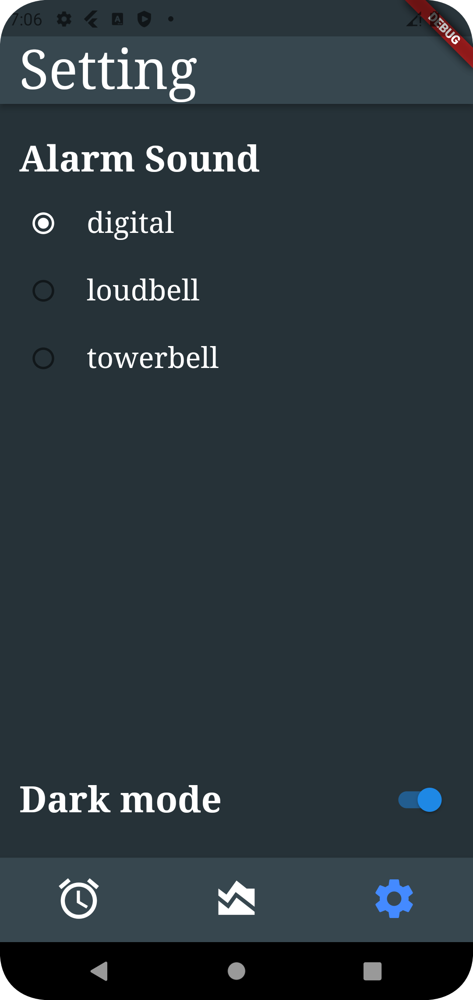

# firstproject : Nightwise

Introducing Nightwise, my Sleep Companion, the ultimate tool for improving your sleep and waking up refreshed!
Our app is designed with your specific needs and preferences in mind, providing personalized recommendations 
and tools to help you get the best sleep possible.

It can can solve several pain points related to sleep, including:

Difficulty falling asleep: Many people struggle to fall asleep at night, which can be due to a variety of factors such as stress, anxiety, or an irregular sleep schedule. A sleep-organized app can help establish a consistent sleep routine, including reminders to wind down before bed and create a relaxing sleep environment.

Poor sleep quality: Some people experience interrupted or restless sleep, which can lead to fatigue, decreased productivity, and other health issues. A sleep-organized app can help identify patterns in your sleep behavior and offer recommendations for improving sleep quality, such as adjusting your sleep environment or practicing relaxation techniques.

Inconsistent sleep schedule: Irregular sleep patterns, such as staying up late on weekends or traveling across time zones, can disrupt the body's natural sleep-wake cycle. A sleep-organized app can help regulate your sleep schedule by providing reminders for consistent bedtime and wake-up times, as well as offering tips for managing jet lag.

Lack of awareness: Many people are unaware of how much sleep they actually need or how their sleep habits affect their health. A sleep-organized app can provide personalized recommendations based on your sleep patterns, as well as educational resources to help you better understand the importance of good sleep hygiene.
 
## Feature

1. Sleep tracking: The app can track users' sleep patterns and provide data on how long they sleep, how often they wake up during the night, and how restful their sleep is overall. This data can help users identify patterns and make changes to their sleep habits to improve their sleep quality.

2. Sleep sounds and music: The app can offer a variety of sleep sounds, such as white noise, rain, or ocean waves, to help users fall asleep and stay asleep through the night. Users can also listen to calming music to help them relax.

3. Theme friendly: The app provide eye friendly theme color. Blue light can affects our sleep and cause insomnia as it changes our circadian rhythm. the theme color of the app contribute to creating a calming and relaxing environment, which can help users wind down and prepare for sleep.

## Screenshots

|              Alarm              |                Countdown                |              Wake up              |
|:-------------------------------:|:---------------------------------------:|:---------------------------------:|
|  |  |  |

|               Sleeping Graph                |                Setting (dark)                 |                 Setting (light)                 |
|:-------------------------------------------:|:---------------------------------------------:|:-----------------------------------------------:|
|  |  |  |
